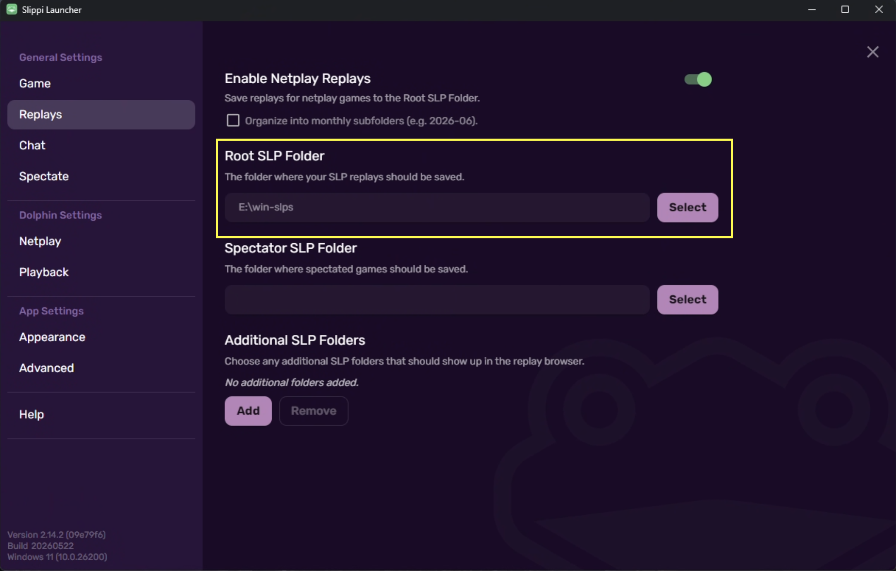

<h1>
  
  LylatLink
</h1>

LylatLink is a small companion app for Slippi that adds voice chat with opponents. It is designed to be extremely simple to use - leave it running in the system tray, play Slippi, and it automatically opens a voice call when both players in a match are using LylatLink. 

Core details:
- **Tiny executable size** - built fully in Go; no Electron nonsense
- **Fully open source**
- **Simple UI** - little menu in your system tray + an info and status overlay in-game [overlay WIP] 
- **No login**, just parses .slp files and matches players accordingly
- Only one required config piece: set .slp replay folder
- **End Call** menu button and hotkey: quickly terminate calls with toxic players [hotkey WIP]
- **Player IP protection** - audio is P2P but routed through a relay server
- Absolutely **zero server-side capture or analysis of audio**, nothing is stored, the server is purely a relay to protect player IPs
- Cost is out of my pocket but cheap :,)
- Matches with >2 players not currently supported, but can be if there is demand (or someone can raise a PR)

## Download

- [Windows](https://github.com/itsonlyMiRE/lylatlink/releases/latest/download/lylatlink-windows-amd64.zip)
- [macOS](https://github.com/itsonlyMiRE/lylatlink/releases/latest/download/lylatlink-macos-arm64.zip) (M1/M2/M3/M4 Apple Silicon)
- Linux and Intel macOS are not currently supported.

## Setup

1. Download the latest release for your platform above.
2. Run LylatLink.
3. Open the tray menu and choose **Replay Folder**.
4. Select the folder that stores your .slp replays. ***Note:** If you organize replays into monthly subfolders, choose the parent Slippi folder; i.e., if they save to [path]/Slippi/2026-06, select the 'Slippi' folder.*

If needed, you can find the folder location in Slippi Launcher under Replay settings:



That is the only required setup.

## Audio

LylatLink uses your system default microphone and speaker/headphones by default.

The tray menu includes input and output device pickers. Choosing **System Default** lets your operating system continue routing audio to the current default devices.

Default audio settings:

```toml
input_gain_db = 0.0
output_gain_db = -1.5
noise_gate_threshold_db = -45.0
```

You can edit these from the tray menu with **Edit Config File**. Changes apply to the next voice session.

## Notes

- LylatLink runs from the system tray by default.
- The call ends automatically when the match ends.
- **End Call** in the tray menu manually disconnects the current voice session.
- No login is required.

Developer notes live in [docs/DEV.md](docs/DEV.md).
