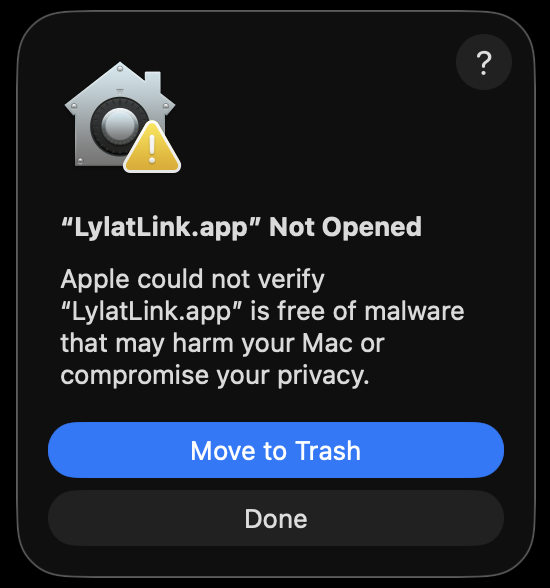
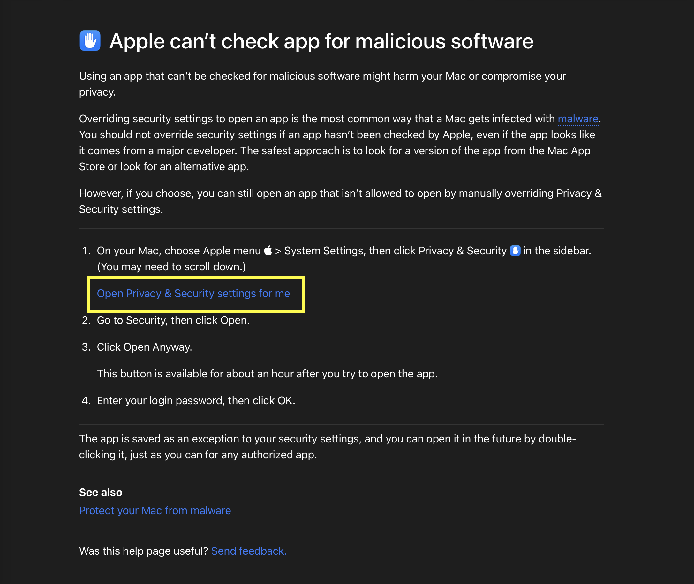
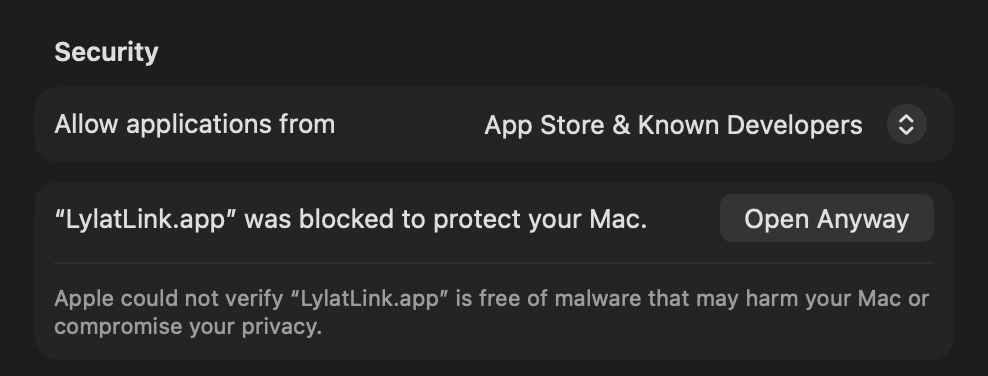

# Apple Security Warning Fix

The macOS build of LylatLink is unsigned. That does **not** mean the app is malware. It means I am not paying Apple $99/year for a Developer ID certificate just to make macOS stop showing this warning.

Because the app is unsigned, macOS may block it the first time you open it and say Apple could not verify that it is free of malware. You can approve it from macOS Privacy & Security settings. After approval, that copy of LylatLink should keep opening normally unless you replace, move, or re-download it.

## Steps

1. Try to open `LylatLink.app`.

   macOS may show this warning:

   

2. Click the `?` button in the top-right corner of that warning.

   That opens Apple's help page. Click **Open Privacy & Security settings for me**.

   

3. In **Privacy & Security**, find the message that says `LylatLink.app` was blocked, then click **Open Anyway**.

   

4. Confirm the final prompt(s).

After that, launch `LylatLink.app` normally, and it will run in your tray.

Note that this will need to be repeated if you ever remove or replace/update/reinstall the app. Thanks Apple
